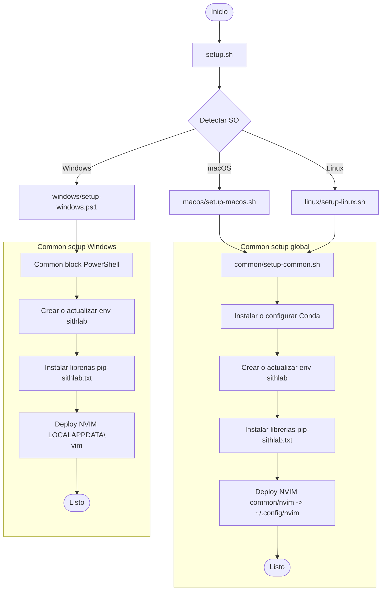

# ⚙️ Configuraciones Personales – Entornos y Terminal  d

Este repositorio contiene la configuración de mi entorno de desarrollo en diferentes sistemas operativos: **Linux**, **MacOS** y **Windows**.

---
## Diagrama de flujo

---
## 📁 Estructura del Repositorio
<!-- BACKUP_LOG_START -->
| Fecha | Evento | Detalle |
|---|---|---|
| 2025-06-23 | Respaldo automático | pip + apt + conda (base) |
| 2025-06-23 | Respaldo automático | pip + paquetes + conda (base) |
<!-- BACKUP_LOG_END -->
